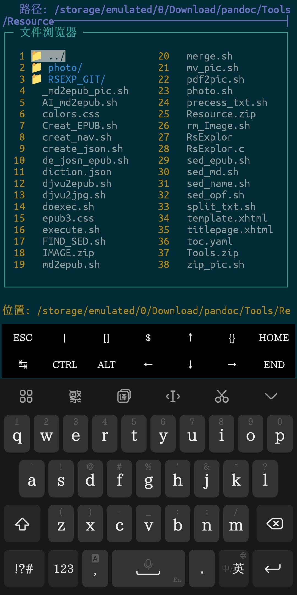

# RsExplor - 终端文件管理器

 

一个基于 ncurses 的轻量级终端文件管理器，专为 Termux 设计。

功能是用这个灵活的文件管理器管理放在安卓文件夹中的 BASH 脚本。

## 功能特性

- 📁 直观的两栏文件浏览
- 🔍 内置文件搜索功能
- 📝 文本文件快速编辑（vi）
- 🗜️ 压缩文件查看与解压
- 🎨 彩色文件类型标识
- 🚦 防误触设计

## 安装要求

- Termux 环境
- ncurses 库
- 基本 Unix 工具（tar, unzip 等）

## 安装方法

```bash
# 克隆仓库
git clone https://github.com/Doblinac/RsExplor.git

cd RsExplor

# 编译安装
初次编译： make
第二次编译： make clean && make
```
